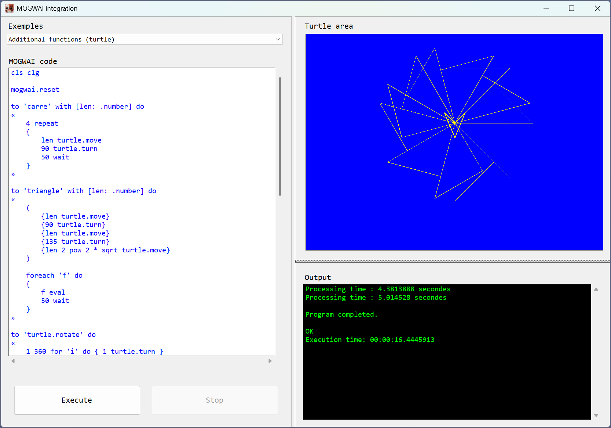
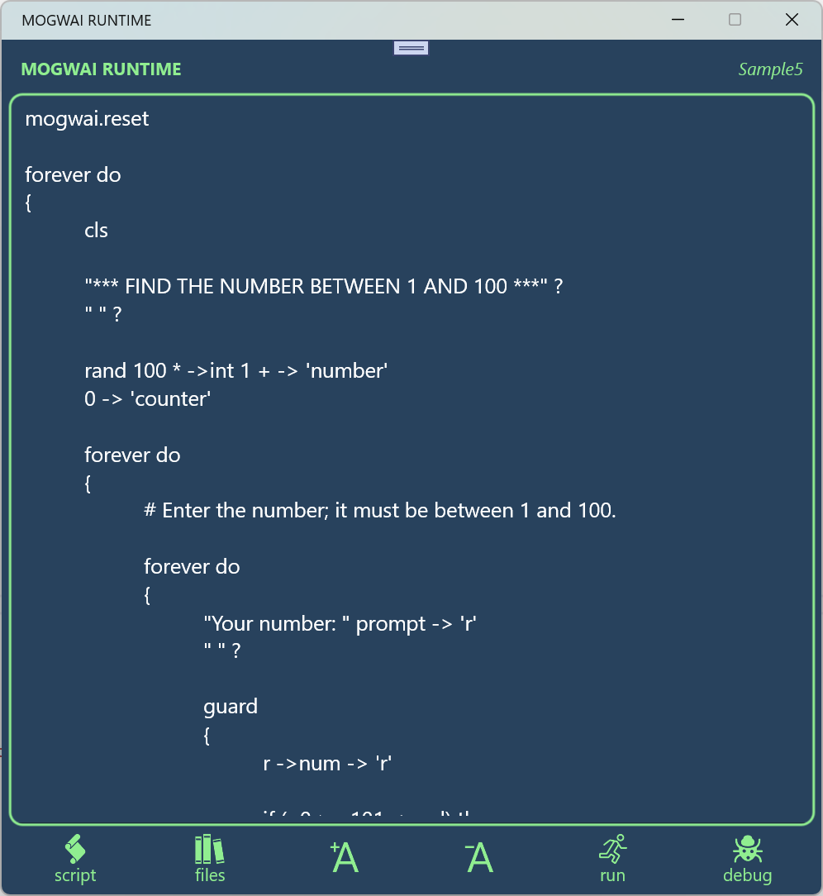
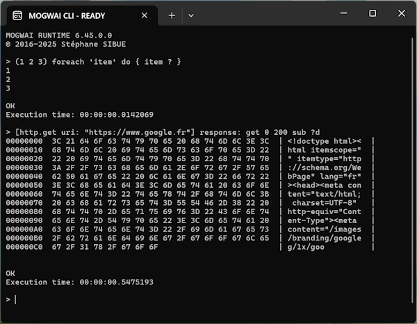

# MOGWAI EXAMPLES

This repository contains examples of integrating the [**MOGWAI runtime**](https://www.mogwai.eu.com) into applications.

## `WinFormsMogwai` project

This example shows how to integrate the **MOGWAI** runtime into a **.NET WinForm** application.

Several **MOGWAI** scripts are available (you can add your own quite easily).

One of the scripts shows how to add features to **MOGWAI** by adding support for turtle graphics programming (like with the LOGO language).

## `MauiMogwai` project

This example demonstrates how to integrate the **MOGWAI runtime** into a **.NET MAUI** application that can target Windows, iOS, and Android.

The application lets you input **MOGWAI** code, store it, run it, and if you have [**MOGWAI STUDIO installed**](https://studio.mogwai.eu.com), start a debug session.

Click on the image below to watch the application video.

## `MOGWAI_CLI` project

**MOGWAI CLI** is a console application that allows you to test and learn the **MOGWAI** runtime language interactively.

Each line you type is executed immediately, and all language commands and functions are available.

This example shows how to integrate the **MOGWAI** runtime into a **.NET Console** application.

You can see how to use **MOGWAI CLI** in [the repository](https://github.com/Sydney680928/MOGWAI_CLI) which allows you to download a compiled version for multiple platforms.

---
Back to the [main MOGWAI GitHub repository](https://github.com/Sydney680928/MOGWAI-PUBLIC)
